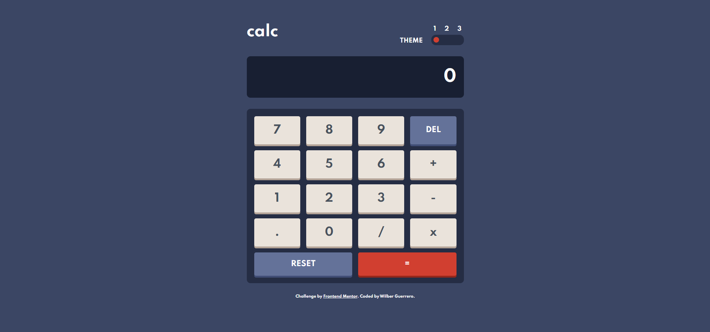

# Frontend Mentor - Calculator app solution

This is a solution to the [Calculator app challenge on Frontend Mentor](https://www.frontendmentor.io/challenges/calculator-app-9lteq5N29).

## Table of contents

- [Overview](#overview)
  - [The challenge](#the-challenge)
  - [Screenshot](#screenshot)
- [My process](#my-process)
  - [Built with](#built-with)
  - [What I learned](#what-i-learned)
  - [Useful resources](#useful-resources)
- [Author](#author)

## Overview

### The challenge

Users should be able to:

- See the size of the elements adjust based on their device's screen size
- Perform mathmatical operations like addition, subtraction, multiplication, and division
- Adjust the color theme based on their preference

### Screenshot

## My process

### Built with

- HTML
- CSS (Custom properties, Flexbox, Grid)
- [SASS](https://sass-lang.com/) - CSS pre-processor
- Mobile-first workflow

### What I learned

In this project, I learned how to write regular expressions (regex) and used them to validate strings. Also, I learned how to implement event delegation, which helped me to significantly reduce the number of events in the project and made the project more scalable.

### Useful resources

- [RegexOne](https://regexone.com/) - This website helped me to learn regex.
- [regex101](https://regex101.com/) - This website was very useful for testing the regex I wrote.
- [Studytonight](https://www.studytonight.com/post/build-a-theme-switcher-for-your-website-with-javascript) - This article taught me how to implement the logic of the theme switcher used in this project.

## Author

Coded by [Wilber Guerrero](www.linkedin.com/in/wilber-guerrero-gamarra)
